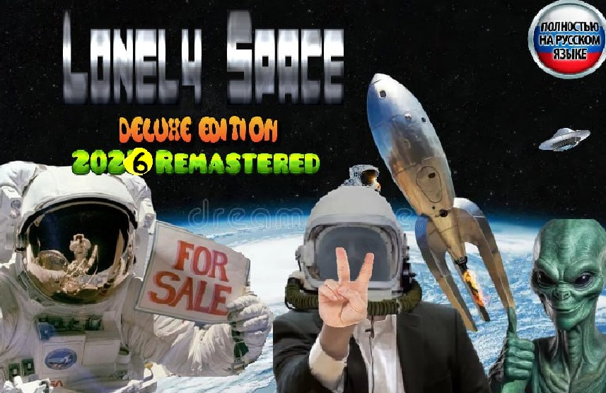

###### Обложка игры от неизвестного фаната.

# Lonely Space

Добро пожаловать в Пустой Космос. Это простая текстовая игра про выживание в открытом космосе после жуткой катастрофы на
Земле. Будьте осторожны, ведь шансы на выживание уменьшаются с каждой секундой! Может быть, кто-нибудь
спасёт вас?

> У нас появился канал в Telegram!
>
> [@lonely_space_game](https://t.me/lonely_space_game)

## Системные требования

- Компьютер (по возможности)
- Новая версия Python (3.14.2)
- Доступ к интернету (для скачивания игры и библиотек)

###### Я не могу гарантировать работоспособность игры на старых версиях Python. Пожалуйста, используйте самую новую.

### Полезная информация:

Для установки новых версий Python на Windows 8 и ниже, воспользуйтесь информацией
из [этого](https://github.com/adang1345/PythonVista) GitHub репозитория.

## Запуск игры

Инструкция по загрузке и установке игры находится [здесь](database/HOW-TO-INSTALL.md#как-скачать-игру).

Если возникнут трудности с запуском игры, обратитесь к [руководству по устранению неполадок](database/GAME-TROUBLESHOOTING.md#устранение-неполадок)

# Обратная связь

Если возникли трудности или вы хотите помочь сделать игру лучше, свяжитесь с нами
через [GitHub Issues](https://github.com/queuejw/LonelySpace/issues)

# В разработке

Игра не готова, поскольку не реализованы многие функции, которые я хотел бы видеть хотя бы на начальном этапе.

- [x] Основа игры, "движок"
-
    - [x] Обработка ввода игрока
-
    - [x] Обновление терминала
-
    - [x] Сохранения
-
    - [x] Остановка игры
- [ ] Геймплей
-
    - [x] Планеты
-
    - [ ] Звуки
-
    -
        - [ ] Музыка
-
    -
        - [x] Реплики бортового компьютера.
-
    - [x] Температура
-
    - [x] Информация о корабле
-
    - [x] Информация о планетах
-
    - [x] Путешествие по планетам
-
    - [x] Случайные события на планетах
-
    - [x] Случайные события в космосе
-
    - [x] Поломки на корабле
-
    - [ ] Взаимодействие с кораблём
-
    -
        - [x] Переименовать корабль
-
    -
        - [ ] Ремонт корабля
-
    -
        - [ ] Создание предметов
-
    -
        - [ ] Тушение пожаров
-
    -
        - [ ] Стрельба

## Помощь с разработкой

Я предоставляю всю необходимую информацию для тех, кто желает внести свой вклад в этот проект.

Вся доступная информация находится в директории database в этом репозитории.

Я постоянно улучшаю справку, исправляю какие-либо косяки. Буду рад, если Вы поможете мне.

Быстрые ссылки:

- [Создание своих планет](database/CREATING-PLANETS.md#создание-планет)
- [Создание своих событий](database/CREATING-EVENTS.md#события)
- [Запуск игры](database/HOW-TO-INSTALL.md#как-скачать-игру)

## Важная информация

Эта игра содержит контент, созданный при помощи ИИ.

Реплики бортового компьютера:

1. Генерация реплик от [Weights AI](https://www.weights.com/)
2. [Модель](https://www.weights.com/ru/models/clor7f4bk016nwszki6flj9ps)
3. Оригинальная озвучка является **голосом нанокостюма** из компьютерной игры **Crysis**, разработанной немецкой
   компанией
   Crytek и изданной Electronic Arts.

Музыка в игре:

Пока что её нет. =)
